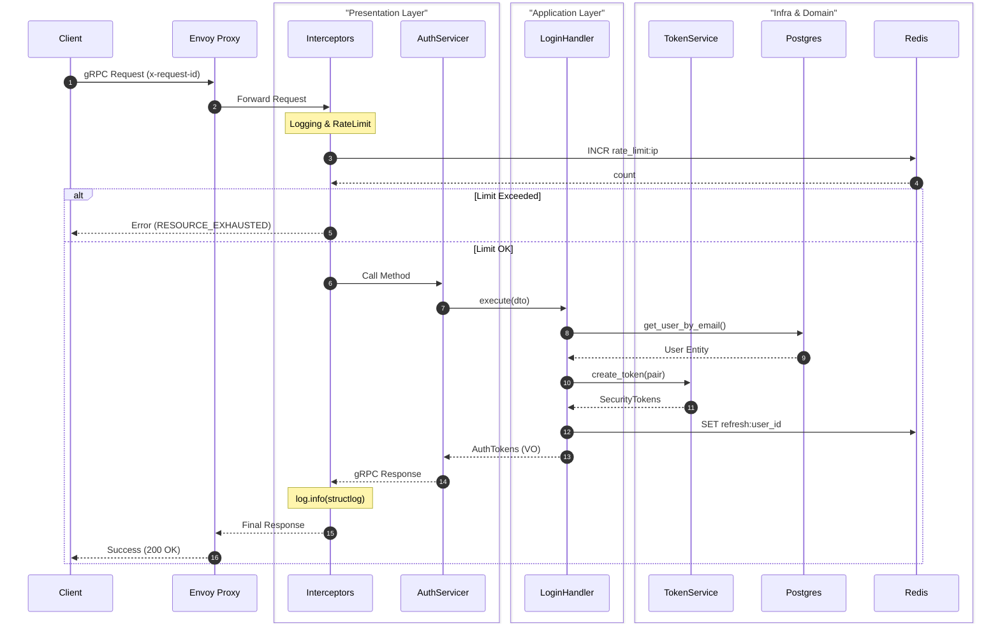

### Запуск

#### Подготовка
```shell
docker compose -f .\deploy\dev-docker-compose.yaml build
docker compose -f deploy\dev-docker-compose.yaml run iam alembic upgrade head
```
#### Запуск
```shell
docker compose -f .\deploy\dev-docker-compose.yaml up  
```

#### Тесты
```shell
docker compose -f .\deploy\dev-docker-compose.yaml run iam pytest  
```
---

### Схема


### Стек
- Python. Де-юре все его преимущества вроде маленького времени до прототипа и понятности, де-факто я вменяемо пишу на нем и на JS, и я не хочу писать на JS *ничего*.
- gRPC. Потому что задача выбрать не простейшее, а правильное решение. Правильным решением кажется выбор наиболее быстрого варианта для высоконагруженного сервиса.
- Envoy. Чтобы использовать gRPC.
- Postgres. Потому что хранить пользователей в sqlite несолидно, а для более быстрого на чтение Mongo долго писать обвязку.
- Redis. Персистентный кеш

### Объяснения где
#### DDD
Вся ключевая логика убрана в отдельный слой. Все новые бизнес-правила должны будут уходить в этот слой по умолчанию и описываться  там. У доменного слоя только базовые зависимости. Он диктует работу остальных слоев.

Оставшаяся часть разделена на инфраструктурный слой (базы данных, сервисы, грязь), на слой приложения (реализация бизнес-правил с помощью инфраструктурного слоя) 
и перезентацию (дает возможность использовать слой приложения).

#### CQRS
Отсутствует. Есть разделение в папках, но я слишком увлекся решением задачи "как убрать асинхронную сессию в декоратор",
что совершенно забыл о том, что нам нужны нормальные репозитории для разделения на разные подключения для чтения и записи.
В общем-то решается просто: удалением общего декоратора (я планировал его как трейдофф) и прокидыванием разных фабрик сессий в разные репозитории.

#### IaC
Ограничено docker compose и локализацией всех переменных в одном месте.

### Ключевые компромиссы
- gRPC. Уменьшенная изоляция сервиса, увеличенная скорость запросов.
- Изолированная база данных для сервиса авторизации. Усложняет жизнь при одновременном создании пользователя и связанных с ним вещей, но дает независимость сервиса авторизации от состояния ненужных данных.
- Информация о пользователе кешируется. Позволяет не дергать постгрес для каждой аутентификации, но при этом появлется зависимость от кеширования
- Полноценная ротация токенов с кешированием. Безопаснее, но все еще зависимость от кеширования
- Shared Session Factory -- упомянуто выше, спорно разгружает внешний вид репозиториев


### Бизнес-правила
1. Регистрация 
   1. Email Unique: Нельзя зарегистрировать два аккаунта на один email.
      1. Любой регистр: "AdMiN" эквивалентен 'admin'.
   2. Email Valid: Соответствует формату email, любой домен.

2. Восстановление пароля (Reset Token)
   1. Expiration (TTL): Токен живет 20 минут.
   2. Rate Limit: Повторный запрос ссылки на восстановление возможен не чаще, чем раз в 60 секунд (защита от спама).

### Как применялся ИИ
- В качестве доков по работе с grpc, потому что я плохо знаком с grpc
- Написал мне код для mermaid схемы по примерному описанию

### Следующие шаги для продакшн версии

#### Если принять за данность, что в имеющемся коде все доделано
- Кешировать токен сброса и не позволять больше одного использования
- Перевести все имена и порты используемых сервисов на переменные
- Убрать все переменные окружения в менеджер секретов
- Обвязка лучше чем докер композ
- CI
#### Если доделывать до рабочего состояния
- Унифицировать ошибки
- Уровни доступа для авторизации и их проверка
- ТЕСТЫ
  - Нормальное покрытие 
  - Аллюр для читаемых сообщений и встраивания в CI
  - Фикстуры с перебором разных вариантов
  - Разные группы тестов под разные сценарии
- Минимальное тестирование для всех хэндлеров
- Доделать рейтлимит
- По-моему кеш не должен знать о ключах, так что это надо передвинуть
- Прошакшн композ
- Настоящий envoy

---


